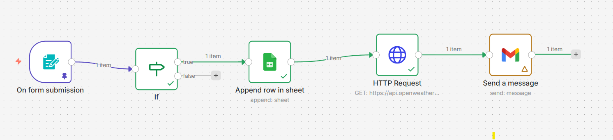

I’ve been experimenting with workflow automation using n8n, and built a simple yet practical system that connects multiple services seamlessly.

🔧 What this workflow does:

When someone submits a form → their data is automatically stored in Google Sheets
Based on conditions → workflow continues execution
Fetches real-time weather data using OpenWeather API
Sends a personalized email with weather updates 🌤️
Runs daily at 8 AM, so users receive timely updates about their city

💡 Why this matters:
This kind of automation can be used for:

Daily alerts (weather, reminders, reports)
CRM or lead tracking systems
Personalized notifications at scale

⚙️ Tech Stack Used:

n8n (workflow automation)
Google Sheets API
HTTP Request (OpenWeather API)
Email Node (Gmail)

📌 Key Learning:
Automation isn’t just about saving time — it’s about creating smarter systems that work for you consistently without manual effort.

Here’s a glimpse of the workflow 👇
(Form → If → Google Sheet → Weather API → Email)
## 📸 Workflow Screenshot

#n8n #Automation #WorkflowAutomation #NoCode #APIs #GoogleSheets #Productivity #OpenWeather #TechProjects #LearningByDoing
